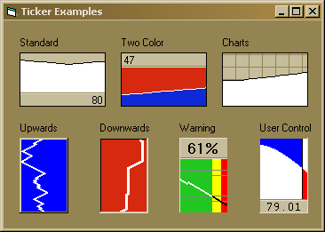



## MyTicker Control

### Description

When you need to display the history of a changing value, there is a bit of work that must be done. This UserControl does that work for you in all sorts of colors and styles. Don't forget to vote!
 
### More Info
 

             |
---                |---
**Submitted On**   |2004-03-06 01:55:42
**By**             |[Larry Serflaten](https://github.com/Planet-Source-Code/PSCIndex/blob/master/ByAuthor/larry-serflaten.md)
**Level**          |Intermediate
**User Rating**    |5.0 (25 globes from 5 users)
**Compatibility**  |VB 5\.0, VB 6\.0
**Category**       |[Custom Controls/ Forms/  Menus](https://github.com/Planet-Source-Code/PSCIndex/blob/master/ByCategory/custom-controls-forms-menus__1-4.md)
**World**          |[Visual Basic](https://github.com/Planet-Source-Code/PSCIndex/blob/master/ByWorld/visual-basic.md)
**Archive File**   |[MyTicker\_C171664362004\.ZIP](https://github.com/Planet-Source-Code/larry-serflaten-myticker-control__1-52166/archive/master.zip)

